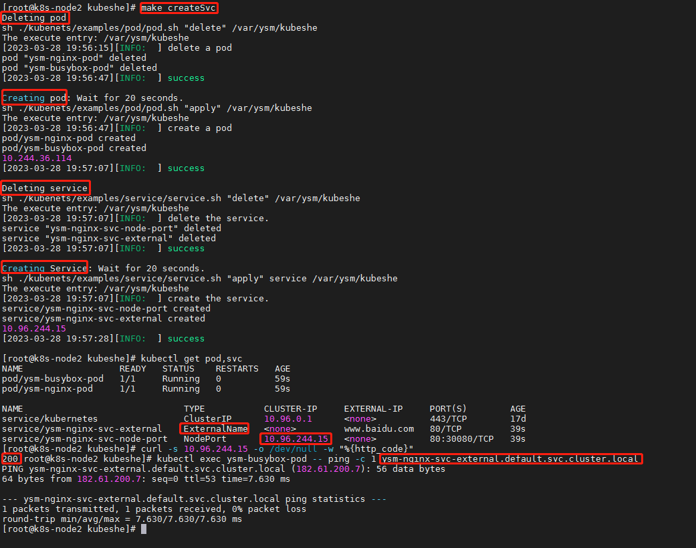

# kubeshe 

## introduce
> one click install kubernets with shell script in Centos7. What you can learned
in this project:
1. how to write the linux shell .
2. use expect to run command in a interacting mode, like config the login without password around some machine.
3. the make file skill.
4. how to install k8s, its dependencies.
5. the core concepts.
6. example of the k8s's core concept like: pod. deployment, dynamic pv ... 
7. how customization components worked fine with k8s. like: coredns, harbor. 
contained, dashboard and so on.
8. ...

## usage
### <a name="one_click">one click install k8s master.</a>
At the root path. run command:
```shell
    ./main.sh --ssh username password --k8s_nodes master_ip:node1_ip:node_2_ip
    # example:
    # your machine username and password is root/root and the k8s cluster is 
    # 10.128.170.31(master) 10.128.170.32 10.128.170.33
    ./main.sh --ssh root root --k8s_nodes 10.128.170.31:10.128.170.32:10.128.170.33
    you can run ./main.sh -h for more information.
```

### <a name="makefile">makefile for k8s examples</a>.
> makefile supported k8s' examples. all examples will autotest after deployment.
1. get all resource info.
    ```shell
    make <get| getAll>
    ```
2. create a pod:
    > this will create a nginx pod and open the 80 port for visiting.
    > in this case, would delete the existed pod at first.
    ```shell
    make <createPod | applyPod>
    ```
3. delete a pod:
    > delete the existed pod.
    ```shell
    make  deletePod
    ```
4. create a service.
    > create a service with type of ClusterIp, NodePort, externalName.
    > in this case, would create a corresponding nginx pod for requests processing.
    ```shell
    make <createService | createSvc | applyService | applySvc>
    ```
5. delete a service
    > delete the service, and its existed pod.
    ```shell
    make <deleteService | deleteSvc>
    ```
6. create a deployment
    > create the deployment which has two nginx pod.
    ```shell
    make <createDeploy | createDeployment | applyDeploy | applyDeployment>
    ```
7. delete a deployment
    > delete the created deployment.
    ```shell
    make <deleteDeploy | deleteDeployment>
    ```
8. create a statefulSet
    ```shell
    make <applySts | createSts | applyStatefulSet | createStatefulSet>
    ```
9. delete a statefulSet
    ```shell
    make <deleteSts | deleteStatefulSet>
    ```
10. create a daemonSet
    ```shell
    make <applyDs | applyDaemonSet | createDs | createDaemonSet>
    ```
11. delete a daemonSet
    ```shell
    make <deleteDs | deleteDaemonSet>
    ```
12. create a job
    ```shell
    make <applyJob | createJob>
    ```
13. delete a job
    ```shell
    make <deleteJob>
    ```
14. create a cronJob
    ```shell
    make <applyCj | applyCronJob | createCj | createCronjob>
    ```
15. delete a cronJob
    ```shell
    make <deleteCj | deleteCronJob>
    ```

for the example creating a service and its' pod:


## done
1. [one click install k8s cluster](#a-nameoneclickone-click-install-k8s-mastera).
2. add the func to test whether the k8s installed fail or success.
3. set the kube-proxy mode to ipvs from iptables.
4. [add the makefile for pod, service, deployment, statefulSet, daemonSet ans other examples](#a-namemakefilemakefile-for-k8s-examplesa).


## todo
1. fmt the code beautifully.
2. set harbor as a individual hub.
3. the pv, pvc makefile.
4. add the visualization user interface.

## others
> there is some thought for this project.
###  the shell execution process.
> the process steps( installing at the master but not salves.):
1. process the input. which is the common func.
2. common utils installing.
3. master installing.
4. nodes installing in a loop from master with ssh.
5. extract the trans to a lib func.
6. and then, use the make cmd to install or set some customization.


## Notices
1. all nodes' password must in same.
2. the centos's kernel must be latest:3.16.12
3. only support for single node master.
